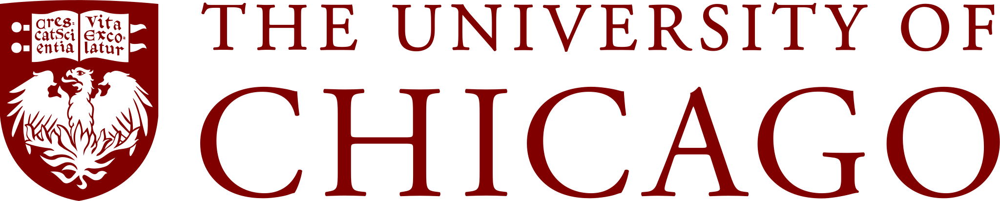
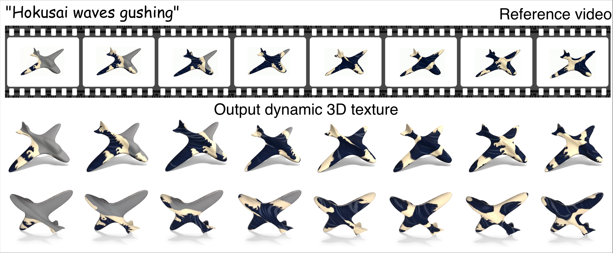

# DynaMesh: Dynamic 3D Texture Generation

[Raj Hansini](https://github.com/rajhansini)<sup style="font-size: 0.7em;">\*</sup>, [Guan Chen](https://github.com/Guanc27)<sup style="font-size: 0.7em;">\*</sup>, [Rana Hanocka](https://people.cs.uchicago.edu/~ranahanocka/), [Itai Lang](https://itailang.github.io/)
<br> <sup style="font-size: 0.7em;">\*</sup>Equal contribution

<span style="position: relative; display: inline-block;">
  
</span> <br>

<br>
<a target="_blank" href="https://threedle.github.io/dynamesh/"></a> <a target="_blank" href="https://arxiv.org"></a>
<!-- TODO(badges): swap the placeholder above for a real arXiv badge + link, and add the conference badge, once those exist. -->

<br> 

## Abstract
We present DynaMesh, a dynamic texture generation method for 3D meshes. Given a textureless shape and a text prompt describing an effect, our method produces an appearance that evolves with the object's geometry unchanged. Previous works on dynamic 3D content generation have focused on motion, where an object's geometry and position change while keeping its appearance the same. Methods on texture generation sit on the other side of the problem, painting appearance onto a shape as a fixed surface property and not as an evolving process. Neither addresses a visual effect that propagates on a 3D object.

A natural route consists of two generators: a video model that shows the effect from a single view, and an image-to-3D generator that lifts each frame to 3D. However, the latter has no notion of time, so running it per video frame produces a sequence that flickers, loses effect details, and yields a different mesh at every video frame. Our method addresses these failures by conditioning a video model on a render of the mesh and the prompt to obtain a reference video, then running a frozen image-to-3D generator on the video with two changes. The conditioning of each frame is blended over a temporal window, and low-rank adapters are fit per shape to restore the lost details. The mesh is encoded once for the whole sequence, so geometry is constant by construction, and the output is a single mesh with a texture per frame. Applied to various objects and effects, DynaMesh substantially improves over recent video-to-4D and texturing methods, and can generalize its temporal effect to different shapes never seen during training.

## Installation
Clone this repository:
```bash
git clone https://github.com/threedle/dynamesh.git
cd dynamesh/
```

Create and activate a conda environment:
```bash
conda create -n dynamesh python=3.10.20 --yes
conda activate dynamesh
```

Alternatively, you may create the environment locally inside the `dynamesh` folder and activate it as follows:
```bash
conda create --prefix ./dynamesh python=3.10.20 --yes
conda activate ./dynamesh
```

Install the required packages:
```bash
sh ./install_environment.sh
```

Note: the installation assumes a machine with a GPU and CUDA. `nvdiffrast`, `spconv` and TRELLIS.2's own `flex_gemm` are compiled extensions; if any of them fails to build, follow the setup instructions in the [TRELLIS.2 repository](https://github.com/microsoft/TRELLIS.2), which cover them directly.

Training (`train.py`) peaks at 19.1 GB of GPU memory, and inference (`bake.py`/`render.py`/`export.py`) at around 12 GB, both measured on an NVIDIA A40; a 24 GB card or larger covers both.

## Image-to-3D Backbone
DynaMesh fits adapters onto a frozen [TRELLIS.2](https://github.com/microsoft/TRELLIS.2) generator. A copy of its `trellis2` package ships under `./trellis2/` in this repository, with three files modified for compatibility with the environment above.

If you'd rather point at your own TRELLIS.2 checkout instead, export `TRELLIS2_ROOT=/path/to/TRELLIS.2`.

## Model Access
The weights are pulled from HuggingFace on first use and cached under `$HF_HOME` (default `~/.cache/huggingface`). Two of the models TRELLIS.2 loads are gated, so before the first run:

* Request access to [facebook/dinov3-vitl16-pretrain-lvd1689m](https://huggingface.co/facebook/dinov3-vitl16-pretrain-lvd1689m). This one is approved by hand, so request it early.

* Accept the terms of [briaai/RMBG-2.0](https://huggingface.co/briaai/RMBG-2.0).

Create a token at [huggingface.co/settings/tokens](https://huggingface.co/settings/tokens) → "New token" → role "Read", then log in with it:
```bash
hf auth login
```

If your GPU node has no internet access: run `train.py`, `bake.py`, `render.py`, or `export.py` once on a machine that has internet access, so HuggingFace downloads the weights into `$HF_HOME`. Then, on the offline node, set this so it reuses that cache instead of reaching out to HuggingFace:
```bash
export DYNAMESH_OFFLINE=1
```

## Demo
This demo shows how to render a dynamic texture with a pre-trained adapter, a reference video of the effect, and a mesh, for a `spot` shape with a lava effect.

The demo assets ship with this repository:
* The `spot` mesh will be stored at `./meshes/spot.obj`.

* The 150 reference video frames will be stored at `./demo/spot_lava/frames/`.

* The training targets, the per-frame supervision `train.py` fits the adapter against, will be
  stored at `./demo/spot_lava/targets/`: one `gt_*.png` (the video frame's color at every pixel
  of our mesh's own silhouette, since the reference video and our render share one fixed camera)
  and one `valid_*.npy` (that silhouette itself, marking which pixels count for the loss) per
  frame under `frames/`, plus a shared `render_mask.npy` beside them.

* The run configuration will be stored at `./demo/spot_lava/run/config.json`.

* The pre-trained adapter will be stored at `./demo/spot_lava/run/ckpts/lora_best.pt`.

The same assets are also attached to the [demo-v1 release](https://github.com/threedle/dynamesh/releases/tag/demo-v1), and `download_demo_data.sh` fetches them from there.

Bake one texture map per video frame:
```bash
python bake.py --run ./demo/spot_lava/run --frames 1-150 --arm adapted
```

Render a turntable of the result:
```bash
python render.py --run ./demo/spot_lava/run --sweep both --turns 0 --n-frames 150
```

Export the textured mesh as GLB and PLY:
```bash
python export.py --run ./demo/spot_lava/run --frames 1-150
```

For each run, the following results will be saved under `./out/`:
* One `mesh.obj` and a texture map per frame, `tex_f0001.png` ... `tex_f0150.png`. The geometry is identical in every frame by construction, so only the color is written per frame.
* A turntable video of the result. `--turns 0` holds the camera at the training view, so everything that changes is the texture; `--turns 1` orbits once across the sequence, and `--turns 2` twice, so every surface point is seen at two different points in the effect's evolution.
* Both the original TRELLIS.2 output (`--arm frozen`, the unmodified generator) and DynaMesh's
  output (`--arm adapted`, the same sampling with the fitted LoRA applied) are written, from the
  same noise and the same conditioning. Since only the adapter differs between the two runs,
  anything that differs in the output is the adapter's effect.

Note:
Runs are deterministic on a fixed GPU: the same command, checkpoint and inputs reproduce a bake bit for bit on one card. Two physical cards of the same model differ very slightly, because the sparse-convolution and GEMM kernels are autotuned per device and that changes the order of floating-point accumulation. Measured on `spot_lava` across two NVIDIA A40s, the textures differ by at most 7/255 per channel with nothing above 8/255, and `mesh.obj` is identical either way. Pin the job to one device if you need an exact hash match.

## Training Instructions
This section explains how to fit an adapter on your own shape and reference video. These items will be exemplified for the `spot_lava` example.

You need two things before starting: an untextured mesh, and a reference video of the effect as numbered frames. The training targets are generated from them.

### Generating the reference video
The `spot_lava` reference video was generated with [Kling 3 Pro](https://klingai.com), image-to-video, from a single rendered image of the mesh. This costs Kling credits.

1. Render your mesh from a locked camera against a flat white background (`spot_lava`'s input render used a fixed front view, distance 2.6, fov 30, at 1024x1024). This becomes the starting frame for Kling.
2. On Kling, run image-to-video with that render as the input image, 5 seconds, and a prompt that locks the camera and geometry so only the surface color changes. The `spot_lava` prompt:
   > Static tripod framing; the camera is locked — no pan, tilt, roll, dolly, push-in, pull-out, zoom, reframing, or shake. The cow is a single rigid statue: no breathing, swaying, head turn, tail flick, ear movement, limb motion, or micro-jitter; its pose, scale, position and silhouette stay pixel-identical in every frame. The background is flat pure white and never changes — no embers, no heat haze, no glow spill, no particles anywhere outside the object. The effect lives strictly on the surface and never crosses the silhouette edge; nothing drips off, nothing is emitted into the air, nothing lights the white background. The only thing that changes is the colour of the surface itself. Molten lava glows inside deep cracks running across the cow's body — orange-red magma creeping and pulsing along the fissures, flaring to yellow-white at random points then cooling to black crust, new fissures opening unpredictably across the flank, head and legs.
3. Extract every frame from the downloaded video, in order, with no frame-rate conversion:
   ```bash
   ffmpeg -y -loglevel error -i spot_lava.mp4 -vsync 0 -start_number 1 frame_%04d.png
   ```
   A 5 second Kling clip comes out to 150 frames this way, since Kling's own output is natively that frame rate; nothing here forces a specific count.

First, rasterize the mesh's silhouette through the pipeline camera:
```bash
python make_render_mask.py --mesh ./meshes/spot.obj --tag spot --res 960 --raw
```

Then build the per-frame targets against that silhouette:
```bash
python make_targets.py --gt-dir ./demo/spot_lava/frames --render-mask ./out/spot/render_mask.npy \
  --render-res 960 --n-frames 150 --tag spot_lava
```

This writes `gt_0001.png` ... `gt_0150.png` and `valid_0001.npy` ... `valid_0150.npy` under `./out/spot_lava/frames/`, and `render_mask.npy` beside them. Training asserts that this silhouette matches its own render pixel for pixel: if it didn't, some compared pixels would fall where one side has mesh and the other doesn't, so the per-pixel loss would be measuring a shape mismatch instead of a color difference, making the resulting numbers uninterpretable.

Fit an adapter:
```bash
python train.py --mesh ./meshes/spot.obj --gt-dir ./demo/spot_lava/frames --gt-render-dir ./out/spot_lava/frames \
  --mcfm temporal_only_w11 --targets qkvo+sa --rank 4 --epochs 30 --n-frames 150 --recon l1 --lpips --render-res 960 \
  --out-dir ./runs/spot_lava
```

The adapter will be saved to `./runs/spot_lava/ckpts/lora_best.pt`, alongside the run's `config.json` and training log. `--mcfm temporal_only_w11` is the temporal conditioning blend over an eleven frame window. `--targets qkvo+sa` puts low-rank adapters on cross-attention and self-attention, and `--rank 4` is the rank used throughout the paper.

For the original-TRELLIS.2 baseline, with no temporal blend and no adapter, drop `--mcfm` from the command above, then bake with `--arm frozen`:
```bash
python train.py --mesh ./meshes/spot.obj --gt-dir ./demo/spot_lava/frames --gt-render-dir ./out/spot_lava/frames \
  --targets qkvo+sa --rank 4 --epochs 30 --n-frames 150 --recon l1 --lpips --render-res 960 \
  --out-dir ./runs/spot_lava_original_baseline
python bake.py --run ./runs/spot_lava_original_baseline --frames 1-150 --arm frozen
```

Bake and render your own run, exactly as in the demo:
```bash
python bake.py --run ./runs/spot_lava --frames 1-150 --arm adapted
python render.py --run ./runs/spot_lava --sweep both --turns 0 --n-frames 150
```

Every later step reads the mesh and the reference frames back out of the run's `config.json`, so these commands are unchanged from the [Demo](#demo) section.

An adapter is not tied to the shape it was fitted to. Pass a different mesh and the effect transfers, with no retraining:
```bash
python bake.py --run ./runs/spot_lava --mesh ./meshes/bob.obj --frames 1-150
```

## Citation
If you find our work useful for your research, please consider citing:
```
@misc{hansini2026dynamesh,
  author    = {Hansini, Raj and Chen, Guan and Hanocka, Rana and Lang, Itai},
  title     = {{DynaMesh: Dynamic 3D Texture Generation}},
  year      = {2026}
}
```
<!-- TODO(citation): replace @misc with @InProceedings (booktitle, pages, month) on acceptance. -->
